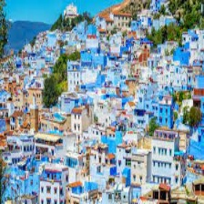
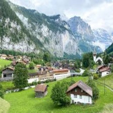

# Ville Chefchaoun
## La ‘perle bleue’ du maroc, Ce qui rend Chefchaouen unique sont ses bâtiments, ruelles et rues peints en bleu, Cette couleur bleue frappante est censée symboliser le ciel et le paradis, favorisant un sentiment de calme et de tranquillité. Dans le cadre de la beauté naturelle que pensez vous des Alpes suisses ?

## les vols disponibles: 
### [suiss](suiss.md):

