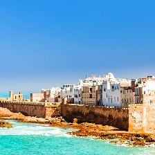

# ville Essaouira
Essaouira est une ville située sur la côte atlantique du Maroc. Elle est réputée pour son architecture charmante, ses plages magnifiques et son ambiance détendue.

# les vols disponibles:
### [marrakesh](marrakesh.md): 

