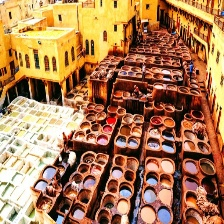

# ville Fes: 
## Fès est réputée pour son artisanat, en particulier pour la poterie, les tapis et le cuir. Les visiteurs peuvent explorer les souks traditionnels, où les artisans perpétuent des métiers ancestraux. Dans le thème artistique, votre prochaine destination est connu par ses galeries d’art, ses théâtres et sa mode. Que pensez-vous ? Avez vous des propositions ?

## les vols disponibles: 
### [paris](paris.md):

