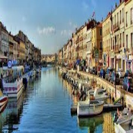

# Ville Londres
## Londres, la capitale du Royaume-Uni, est une métropole dynamique mêlant une riche histoire, une diversité culturelle, des icônes emblématiques comme le Big Ben et une scène artistique florissante.

# Vols disponibles 
## [Sete](Sete.md)

