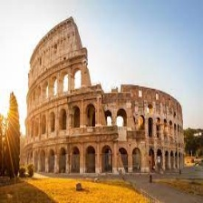

# Ville Rome
## Rome, capitale de l'Italie, est une ville historique renommée pour ses vestiges antiques, ses musées d'art exceptionnels et son rôle central dans l'histoire de l'Europe.

# Vols disponibles
## [??](gameOver.md):
Faites attention à votre choix.

## [peut-etre la fin ?](fin.md):
Faites-moi confiance, prenez ce vol.

