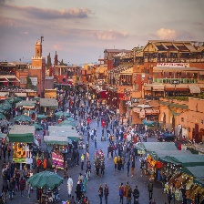

# Clermont-Ferrand:
située dans la région Auvergne-Rhône-Alpes, Clermont-Ferrand est reconnue pour son histoire industrielle, en particulier dans le domaine du caoutchouc et du pneumatique. La ville est entourée de paysages volcaniques, avec le Puy-de-Dôme comme l'un de ses points d'intérêt majeurs

[Clermont-Ferrand](clermont-ferrand.md)
## ville tanger:

