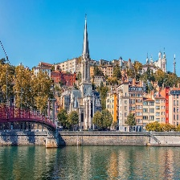

# Clermont-Ferrand:
située dans la région Auvergne-Rhône-Alpes, Clermont-Ferrand est reconnue pour son histoire industrielle, en particulier dans le domaine du caoutchouc et du pneumatique. La ville est entourée de paysages volcaniques, avec le Puy-de-Dôme comme l'un de ses points d'intérêt majeurs

## les vols disponibles:
### [Lyon](Lyon.md):
avec un histoire et son patrimoine architectural voulez-vous visiter Lyon  ?

### [Essaouira](Essaouira.md):
Une ville bien connue pour son festival de Gnawa

