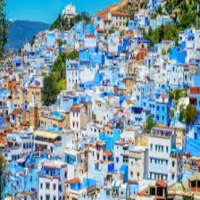

# Aéroport: 
C'est là que votre voyage commencera, essayez de déterminer quel est le bon chemin à suivre.

## les vols disponibles:
### [Clermont-Ferrand](Clermont-ferrand.md):
La ville des volcans

### [Montpellier](montpellier.md):
ville méditerranéenne  réputée pour son climat ensoleillé, ses plages, son mélange architectural entre modernité et histoire

### [Chefchaoun](Chefchaoun.md):
La ville bleue

