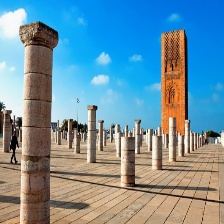

# Ville Rabat
## La capitale politique du maroc est une ville moderne historique. Rabat est un endroit idéal pour les amateurs d'histoire, d'architecture et de culture, offrant une expérience unique au croisement du passé et du présent marocain.

## [Chemin mystérieux](gameOver.md):
Vous avez choisi le mauvais chemin.
